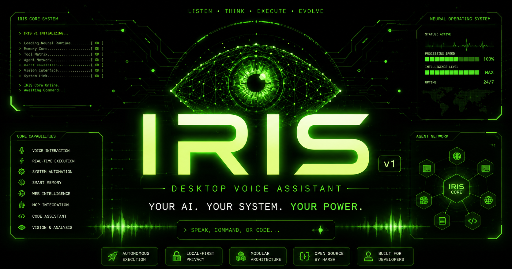

<div align="center">



### Voice-First Desktop AI Assistant

**Build Faster. Automate Workflows. Control your Desktop with Voice Commands.**

---

<div style="display: flex; justify-center; gap: 10px; margin-bottom: 20px;">

  <a href="https://github.com/IRISX-AI/IRIS-AI/stargazers">
    
  </a>

  <a href="https://github.com/IRISX-AI/IRIS-AI/network/members">
    
  </a>

  <a href="https://github.com/IRISX-AI/IRIS-AI/graphs/contributors">
    
  </a>

  <a href="https://github.com/sponsors/201Harsh">
    
  </a>

</div>

**Speak your command. IRIS executes it.**

A voice-first neural execution system powered by **Gemini 3.1 Live API** with real-time WebRTC audio, biometric security, and autonomous system control.

---

</div>

# 📑 Table of Contents

- [⚡ Overview](#-overview)
- [🎯 What is Voice-First?](#-what-is-voice-first)
- [✨ Core Features](#-core-features)
- [🔐 Code Protection & Security](#-code-protection--security)
- [💰 Sponsorship Tiers](#-sponsorship-tiers)
- [🏗️ Architecture](#️-architecture)
- [💻 Tech Stack](#-tech-stack)
- [🚀 Installation & Setup](#-installation--setup)
- [📁 Project Structure](#-project-structure)
- [🧠 Development Philosophy](#-development-philosophy)
- [🤝 Contributing](#-contributing)
- [🧩 Extending IRIS](#-extending-iris)
- [🧠 Roadmap](#-roadmap)
- [⚠️ Disclaimer](#️-disclaimer)
- [👨‍💻 Architect](#-architect)
- [📜 License](#-license)

---

# ⚡ Overview

IRIS is not a chatbot.

It is a **Voice-First Desktop AI Assistant** that executes real-world actions across your system, applications, and devices—powered by **Gemini 3.1 Live API** with real-time bidirectional audio processing.

> **Speak naturally. IRIS understands intent. Real actions execute instantly.**

## What Makes IRIS Different?

✅ **Voice-First Design** – Optimized for natural speech input with real-time WebRTC audio streaming  
✅ **Proprietary Agent Logic** – Heavily protected, production-grade agentic orchestration  
✅ **Production-Ready Security** – V8 bytecode + ASAR integrity validation + window isolation  
✅ **No Code Exposure** – Core agent and tools are completely hidden from public source  
✅ **Autonomous Execution** – LangGraph-powered state machine with dynamic tool orchestration

---

# ✨ What's New In v1.6.0

- Added Wakeup word functionality for seamless hands-free activation
- Introduced Chat/Voice toggle — use voice or text to interact with IRIS
- Advanced Mobile Camera Control: Full control over front/back camera with customized video recording settings
- More precise authentication including IP and Location verification
- IRIS now divided into Free and PRO tiers with distinct badges
- New quick-access overlay available via Ctrl + Shift + I
- Complete UI Upgrade: Simple, premium, and fully animated interface
- Updated Settings panel with a new proper build structure
- Quick Build integration resulting in significantly faster app load times
- Various underlying bug fixes and system stability improvements

---

# 🪡 Open Core Model

### IRIS follows an Open Core development model.

**The public repository includes**:

- Desktop application framework
- User interface
- Core infrastructure
- Selected integrations
- Community-facing examples

The following production components are private:

- Core voice orchestration engine
- Advanced tool execution logic
- Internal automation systems
- Production-grade implementations
- Certain premium modules

GitHub Sponsors receive access to additional documentation, implementation examples, architecture breakdowns, and development resources depending on tier.

**Sponsorship does not include access to the complete private source code.**

---

# 🎯 What is Voice-First?

Traditional AI assistants are **text-first**: you type → they respond → you read.

IRIS is **voice-first**: you speak → they listen & execute → actions happen in real-time.

### Real-Time Audio Processing

```
Your Voice
    ↓ (WebRTC Stream)
Gemini 3.1 Live API (Real-time)
    ↓ (Intent Recognition)
LangGraph Agent Orchestration
    ↓ (Tool Selection)
Protected Tool Execution
    ↓ (System Actions)
Results Streamed Back to You
```

- **Latency:** < 500ms end-to-end (including network)
- **Quality:** Full duplex (talk while agent responds)
- **Models:** Gemini 3.1 Live API (primary) + Groq (Fast Responses) + Hugging Face (Open-Sourced + Local Models)
- **Search:** Tavily for real-time web data

No local-only limitations. IRIS connects to **cloud AI, search engines, and APIs** for maximum intelligence.

---

# ✨ Core Features & System Capabilities

### ✨ Special Features

Autonomous voice activation hooks, advanced screen character peeling, and phantom inline input overlays.

- **Wake Up Word Activation:** IRIS is configured for hands-free local startup. Speaking the wake word automatically opens the assistant window, performs local telemetry diagnostics, and checks real-time atmospheric updates.
  - _Commands:_ "Hey, IRIS", "IRIS", "Wake up, IRIS"
- **Phantom Control (Ghost Keyboard):** Inline typing injection overlay. Activating the shortcut creates a phantom input hook to inject typed keystrokes anywhere on the OS, integrating cleanly with VS Code.
  - _Commands:_ "Press Ctrl + Alt + Space", "Activate Phantom Typer", "Start Ghost Typer"
- **ScreenPeeler (Multimodal AI OCR):** Intelligent rectangular region screen selection. Takes a high-resolution snapshot of any screen coordinate area, runs local/cloud multimodal extraction, and populates extracted text to your clipboard.
  - _Commands:_ "Press Ctrl + Alt + X", "Extract text from active workspace", "Scan system screen portion"
- **Small Ghost Overlay (Ctrl + Shift + I):** [PRO Exclusive] Launches a sleek, floating quick-access mini overlay at your cursor for immediate keyboard/voice commands without opening the main OS dashboard.
  - _Commands:_ "Press Ctrl + Shift + I", "Open quick overlay", "Toggle ghost mini panel"

### 📂 System & File Management

Complete native file system and directory access with app process lifecycle controls.

- **Open App:** Native application lifecycle initialization.
  - _Commands:_ "Open Spotify", "Launch VS Code", "Start Google Chrome"
- **Close App:** Instant process termination hook.
  - _Commands:_ "Close Photoshop", "Kill the Chrome process", "Stop Node"
- **Create Folder:** Directory structure generator.
  - _Commands:_ "Create a folder named assets in my current directory", "Make folder UI under components"
- **Read & Write Files:** Disk file writing and code extraction.
  - _Commands:_ "Read the index.js file inside the root", "Write a server.js file with simple express setup"
- **Smart Drop Zones:** Autonomous sorting algorithms for system files.
  - _Commands:_ "Sort my downloads folder", "Organize my chaotic project directories"

### 🧠 Vector Search & Local Knowledge

Semantic ingestion using local Vector databases and direct multimodal vision APIs.

- **Index Folder:** Index folder contents into a local semantic database.
  - _Commands:_ "Index my src folder", "Embed my docs folder for search"
- **Smart File Search:** Vector-based local file retrieval.
  - _Commands:_ "Find files related to user authentication", "Search for codebase configuration hooks"
- **Analyze Photo & Gallery:** OCR and direct multimodal layout processing.
  - _Commands:_ "Scan my screenshot folder", "Analyze this error screenshot and find a solution"

### 💻 Developer & Terminal Tools

Globally accessible NPM package with tunneling and secure CLI execution.

- **Run Terminal:** Native shell script/CLI executor.
  - _Commands:_ "Run npm run build", "Execute git status", "Run typescript checker"
- **Deploy Wormhole:** Localhost tunnels exposing local servers to the public internet.
  - _Commands:_ "Expose port 3000 to the public internet", "Open local server to external connection"
- **Execute Sequence / Macro:** JSON-based workflow sequence triggering.
  - _Commands:_ "Run the development startup sequence", "Execute my custom deploy macro"
- **Manage PC Settings:** Control OS-level settings like Wi-Fi, Bluetooth, Audio, and Display.
  - _Commands:_ "Turn off Wi-Fi on my PC", "Open the sound settings"

### 🎯 Desktop UI & Automation

AI-driven coordinate cursor control, scroll tracking, and screen peeler OCR.

- **Teleport Windows:** Desktop window movement, resizing, and alignment.
  - _Commands:_ "Move this active window to the left side", "Minimize active window", "Maximize terminal"
- **Click & Scroll on Screen:** Cursor control with AI coordinate calculation.
  - _Commands:_ "Click the login button", "Scroll down fifty percent", "Click at coordinates 800 by 600"
- **Screen Peeler & Phantom Typer:** Instant OCR extraction to code editor.
  - _Commands:_ "Extract code from active window", "Type my secure email address in the active input box"

### 💾 Memory & Information

Persistent identity tracking, note management, and remote inbox integrations.

- **Core Memory Ingestion:** Saves details into permanent memory database.
  - _Commands:_ "Remember that my API host is port 5000", "Forget my old server address"
- **Retrieve Memory:** Retrieves context parameters from past workflows.
  - _Commands:_ "What is my current project setup?", "What wake word configs did I set earlier?"
- **System Notes:** Save ideas, plans, and code snippets into memory notes.
  - _Commands:_ "Create a note for my next project", "What was the plan from my notes?"
- **Read Emails:** Gmail inbox scanning and key data extraction.
  - _Commands:_ "Read my latest unread emails", "Summarize my last developer newsletters"

### 🌐 Web, Media & Financials

Real-time web browsing, music control, market analytics, and image generators.

- **Advanced Web Agent:** Browses the web, performs deep Playwright-based scraping, fills forms, and searches for reference information.
  - _Commands:_ "Search for the latest NextJS 16 features", "Scrape the content from this URL"
- **Spotify & Media Controls:** Instant audio playback control.
  - _Commands:_ "Play synthwave music on Spotify", "Pause playback", "Skip to next track"
- **Market Analytics:** Ticker checks and dual stock comparison.
  - _Commands:_ "Get current stock price of Apple", "Compare NVIDIA and AMD performance charts"
- **Generate Image & Live Website:** Image rendering and dynamic CSS/DOM injections.
  - _Commands:_ "Generate an image of a neon forest", "Inject a cyber-green background to the current site"

### 💬 Communications

WhatsApp scheduling, contact message queues, and mail composing.

- **WhatsApp Integration:** Automate messaging and files sending.
  - _Commands:_ "Send WhatsApp message to Harsh saying: Build is online!", "Schedule a WhatsApp message for tomorrow morning"
- **Mail Drafting & Direct Send:** Email composition and delivery dispatch.
  - _Commands:_ "Draft an email to client about project submission", "Send email containing build report"

### 📱 Mobile Telekinesis

ADB remote control, coordinate touch, notifications reading, and toggle hardware.

- **Remote Android Control:** Open applications and read hardware status remotely.
  - _Commands:_ "Open Slack on my Android device", "Get my phone's battery level", "Toggle phone flashlight"
- **Remote Action Touch & Swipe:** Interactive Android touch executions.
  - _Commands:_ "Swipe down on my phone screen", "Remote click coordinate 400 and 800"
- **Push & Pull Files:** Transfers data seamlessly between phone and workstation.
  - _Commands:_ "Push my screenshot to my Android phone", "Pull documents from mobile directory"
- **Advanced Hardware & Camera Control:** Toggle hardware (Wi-Fi, Bluetooth) and hijack lenses to capture photos/videos remotely.
  - _Commands:_ "Take a picture with my front camera", "Turn off phone bluetooth"
- **Clipboard & APK Deployment:** Inject text directly to mobile inputs or push/install APKs seamlessly.
  - _Commands:_ "Paste this API key to my phone", "Deploy my build to my phone"

### 🕵️ Deep RAG & Autonomous Research

Autonomous Llama 3 agents crawling databases and codebase oracle RAG.

- **Deep Research:** Multimodal agentic crawlers executing deep research cycles.
  - _Commands:_ "Research current breakthroughs in quantum computing and sync it to Notion"
- **Codebase Oracle & RAG:** Ingests entire repositories for semantic queries.
  - _Commands:_ "Ingest my codebase into database", "Ask Oracle: how does the routing layout hook together?"

### 📄 Document & Presentation Generation

Autonomous generation of professional documents, spreadsheets, and presentations.

- **Generate PowerPoint (PPT):** Autonomously generate complete PowerPoint presentations from structured data and open them instantly.
  - _Commands:_ "Generate a PPT about artificial intelligence", "Create a 5-slide presentation on Q3 sales"
- **Generate Excel Spreadsheets:** Create structured Excel sheets from JSON data and launch them.
  - _Commands:_ "Create an Excel sheet with our user data", "Generate a spreadsheet for monthly expenses"
- **Generate Beautiful PDFs:** Generate highly aesthetic PDFs using raw text or Tailwind CSS injected HTML.
  - _Commands:_ "Export this report to PDF", "Generate a beautiful PDF invoice"

### 🛠️ Interactive UI Generation & Live Coding

Spawns live widgets, mutates reality, and writes physical code.

- **Widget Forge:** Spawn live, floating desktop widgets like timers, clocks, or stock tickers.
  - _Commands:_ "Create a floating timer widget", "Spawn a desktop calculator"
- **Design to Widget (Visual UI Extraction):** Visually scans your screen, extracts a UI component, and instantly spawns a live widget.
  - _Commands:_ "Forge a widget out of this table", "Clone that button into a widget"
- **Live Code Forging:** Write, stream, and save raw code into a physical file via an interactive UI.
  - _Commands:_ "Write a Python script for data scraping", "Stream a React component to Button.tsx"
- **Reality Hacker:** Visually mutate and inject custom CSS/JS into live internet websites.
  - _Commands:_ "Make Wikipedia look like a terminal", "Inject the neon green UI into this site"

### 🗺️ Global Maps & Live Location

Interactive real-time map controls and telemetry.

- **Live Location Telemetry:** Fetch your current real-time physical coordinates, city, and timezone.
  - _Commands:_ "Where am I currently?", "What is my live location?"
- **Interactive Dark-Mode Maps:** Open real, interactive maps tailored to the OS aesthetics.
  - _Commands:_ "Show me a map of Tokyo", "Open the map for New York"
- **Route Navigation:** Calculate and display driving directions between cities.
  - _Commands:_ "Get directions from Delhi to Mumbai", "Show the route to San Francisco"
- **Weather Insights:** Fetch real-time weather conditions for any city.
  - _Commands:_ "What's the weather like in London?", "Is it raining in Seattle?"

### 🔐 Security & OS Vault

OS-level biometric encryption and multi-face recognition locks.

- **Vault Lockdown:** PIN validation system lock.
  - _Commands:_ "Lock the system vault", "Activate biometric lockdown mode"

---

# 🔐 Code Protection & Security

## ⚠️ Important: Core Code is Protected

IRIS uses **enterprise-grade code protection** to secure proprietary agent logic and tool implementations:

### What is Protected?

✅ **Agent Core** (`iris-ai.ts`)  
✅ **Tool Implementations** (`tools.ts`)  
✅ **IPC Handlers** (`handlers.ts`)  
✅ **System Utilities** (All Main Process code)

### How It's Protected?

1. **V8 Bytecode Compilation**
   - TypeScript → JavaScript → Binary V8 bytecode
   - Result: `.jsc` files (unreadable, machine-specific)
   - Reverse engineering: 100+ hours of effort

2. **Protected Strings Obfuscation**
   - Sensitive strings transformed to obfuscated functions
   - Example: System prompts, tool definitions, API patterns
   - Grep/string search returns nothing useful

3. **ASAR Integrity Validation**
   - SHA256 hashing at build time
   - Runtime validation at app startup
   - Tampering detection: **App crashes immediately**

4. **Window Isolation**
   - Renderer windows cannot directly access each other
   - All inter-process communication via secure IPC bridge
   - No Node.js in renderer process

### Security Guarantees

- **100% BYOK** (Bring Your Own Key) – Your API keys, your control
- **Local Encryption** – Keys stored in OS keychain, never transmitted
- **Zero-Trust Architecture** – All inputs validated, outputs sanitized
- **No External Validation** – Core logic never phones home

---

# ⚡ Why Upgrade to IRIS Pro?

IRIS is built on an **Open Core model**. While the Free Tier (Public Repository) gives you access to the community UI and basic templates, the **core voice engine, agent loops, and advanced execution tools** are protected within the IRIS Pro ecosystem.

Upgrading to **IRIS Pro (₹499 base license + platform processing fee (Final Checkout: ₹513))** unlocks the complete autonomous OS controller experience.

## 🎁 Free Tier (Base Engine)

**Cost:** Free

- Access to the public frontend shell (React + Tailwind)
- Community Layout Config & Themes
- Standard PIN-only OS Vault lockdown
- Basic UI Widgets & Desktop Shell structure
- **Core File & Desktop Management:** Read/Write files, search system, open apps, move windows.
- **Basic Automations:** Ghost typing, scroll, macro sequences, shortcuts.
- **Maps & Weather:** Live location, navigation, and weather insights.
- **Docs & Email:** PDF Generation and background Email Drafting.

## 🚀 IRIS Paid Pro

**Cost:** ₹499 base license + platform processing fee (Final Checkout: ₹513)

- **Instant License Activation:** Pay once, keep it forever. No subscriptions.
- **Hands-Free Wake Up Word:** Passive offline activation ("Hey, IRIS").
- **ScreenPeeler Multimodal AI OCR:** Instantly scan and extract text/code from your screen (Ctrl+Alt+X).
- **Phantom Ghost Keyboard:** Global inline injection (Ctrl+Alt+Space).
- **Small Ghost Overlay:** Instantly summon a fast-access floating command overlay via `Ctrl + Shift + I`.
- **Mobile Telekinesis (Android):** Full ADB remote actions, telemetry, camera hijacking, file pushing, and APK deployment.
- **Deep Research & Code Oracle:** Multi-step autonomous web crawling, RAG codebase indexing, and vector memory.
- **Wormhole Networking:** Instantly expose local localhost ports to the public internet.
- **Generative Power:** PPT/Excel Generation, Aesthetic Image generation.
- **Live UI Forging:** Build entire animated websites (GSAP + Tailwind) and Forge Screen UI into live Widgets.
- **Direct Communications:** Dispatch WhatsApp messages automatically and directly send emails.
- **Deep Work Protocol:** Instantly mute distractions, kill specific apps, and optimize environment focus.
- **Direct Pro Access:** Fully functional local execution engine.

### How to Upgrade?

1. **Authenticate with Google** to create your secure identity.
2. **Purchase a License** via our Secure Checkout (Razorpay).
3. **Unlock the IRIS PRO** instantly.

[**Check Out The Full Free vs PRO Tool Comparison**](./Comparison.md)

---

---

# 🏗️ Architecture

### Frontend (React)

- UI, widgets, visualizations
- Voice input/output handling
- Real-time metrics display

### Backend (Electron Main Process) - **PROTECTED**

- LangGraph agent orchestration
- Tool execution engine
- Protected by V8 bytecode + ASAR

### IPC Bridge (Secure)

```typescript
// Frontend
window.electron.ipcRenderer.invoke('tool-name', payload)

// Backend (Protected)
ipcMain.handle('tool-name', async (event, payload) => {
  // Secure tool execution
})
```

### AI Integration

- **Gemini 3.1 Live API** – Real-time voice processing
- **Groq API** – Ultra-fast inference fallback
- **Hugging Face** – Local model support
- **Tavily** – Web search & research

---

# 💻 Tech Stack

### 🖥️ Core Desktop & UI Framework

- **Electron & Vite:** High-performance desktop compilation
- **React 19:** Component-based frontend
- **Tailwind CSS v4:** Utility-first styling
- **Framer Motion & GSAP:** Hardware-accelerated animations
- **Three.js & React Three Fiber:** 3D neural visualizations
- **Zustand:** Global state management

### 🧠 AI & Agent Layer (PROTECTED)

- **Google Gemini 3.1 Live API:** Primary reasoning engine + WebRTC audio
- **Groq SDK:** Ultra-fast inference routing
- **LangGraph:** Agentic state orchestration (protected)
- **Hugging Face:** Local model inference
- **LanceDB:** Vector database for RAG & memory

### 🔐 Security & Protection

- **V8 Bytecode:** Code compilation to binary (unreadable)
- **ASAR Integrity:** Package validation + tampering detection
- **electron-vite:** Secure split-process architecture
- **Context Isolation:** Renderer/Main process separation

### ⚙️ OS Control & Automation

- **Nut.js:** Desktop automation (mouse, keyboard, coordinates)
- **Puppeteer + Stealth:** Headless browser & web automation
- **Node Window Manager:** Window lifecycle control
- **Tesseract.js:** OCR for visual extraction
- **Native Utilities:** Audio, clipboard, screenshots

### 🔗 Integrations

- **Google APIs & Auth:** Gmail, Google Cloud
- **Notion Client:** Database sync
- **Tavily Core:** Web search
- **Data Parsers:** PDF, DOCX, HTML

---

# 🚀 Installation & Setup

## For Free Tier Users

### 1. Clone Repository

```bash
git clone https://github.com/IRISX-AI/IRIS-AI
cd IRIS-AI
```

### 2. Install Dependencies

```bash
npm install
```

### 3. Add API Keys

Create `.env` file (copy from `.env.example`):

```env
VITE_GEMINI_API_KEY=your_gemini_key
VITE_GROQ_API_KEY=your_groq_key
VITE_TAVILY_API_KEY=your_tavily_key
```

### 4. Run Development Server

```bash
npm run dev
```

### 5. Build Production

```bash
npm run build:win    # Windows
npm run build:mac    # macOS
npm run build:linux  # Linux
```

---

## For Sponsors ($5+/month)

**Benefits:**

- ✅ Access to working code examples
- ✅ Advanced setup documentation
- ✅ Private support channel

**How to Access:**

1. Become a sponsor: [GitHub Sponsors](https://github.com/sponsors/201Harsh)
2. Get private repo access via GitHub
3. Clone private repository with examples
4. Follow sponsor-only documentation

---

## 🔑 System Keys & Configuration

IRIS operates with **cloud-powered AI**, requiring specific API keys to function.

To ensure absolute privacy and safety, **IRIS does not use local `.env` files** to store keys. All credentials must be entered directly into the secure application interface, where they are encrypted locally on your machine via the native OS keychain.

### ⚙️ How to Configure

- Open the IRIS Desktop App.
- Navigate to **Settings**.
- Select the **API** tab.
- Paste your keys and save them securely.

---

### Required Keys

**[Google Gemini API](https://aistudio.google.com/app/apikey)**

- Primary reasoning engine for IRIS.
- Real-time voice processing (WebRTC).
- Multimodal vision capabilities.
- Setup: Google AI Studio → Get API Key → Create.

**[Groq API](https://console.groq.com/keys)**

- Ultra-fast inference fallback.
- Sub-100ms response times.
- Setup: Groq Console → API Keys → Create.

---

### Optional Keys

**[Tavily Search API](https://app.tavily.com/home)**

- Real-time web search & research.
- Powers Deep Research agent.
- Setup: Tavily Portal → Generate key.

**[Hugging Face Token](https://huggingface.co/settings/tokens)**

- Local model inference.
- Community model access.
- Setup: Create Hugging Face account → Access Tokens.

---

# 📁 Project Structure

# Project Structure

```
├── assets
│   ├── banner-old.jpeg
│   └── banner.png
├── bin
│   └── iris-ai.ts
├── build
│   ├── entitlements.mac.plist
│   ├── icon.icns
│   ├── icon.ico
│   └── icon.png
├── docs
│   ├── architecture
│   │   └── system-design.md
│   ├── core-systems
│   │   ├── local-memory.md
│   │   ├── os-automation.md
│   │   └── voice-engine.md
│   ├── development
│   │   ├── setup-guide.md
│   │   └── tool-creation.md
│   ├── security
│   │   └── local-vault.md
│   ├── troubleshooting
│   │   └── common-issues.md
│   ├── AGENT_ORCHESTRATION.md
│   ├── API_INTEGRATION.md
│   ├── API_REFERENCE.md
│   ├── ARCHITECTURE.md
│   ├── AVAILABLE_TOOLS.md
│   ├── CHANGELOG.md
│   ├── CODE_PROTECTION.md
│   ├── CONTRIBUTING.md
│   ├── CUSTOMIZATION.md
│   ├── DEPLOYMENT.md
│   ├── DEVELOPMENT.md
│   ├── EXAMPLES.md
│   ├── FAQ.md
│   ├── GETTING_STARTED.md
│   ├── GLOSSARY.md
│   ├── INDEX.md
│   ├── IPC_BRIDGE.md
│   ├── PERFORMANCE.md
│   ├── ROADMAP.md
│   ├── SECURITY.md
│   ├── SPONSORSHIP_GUIDE.md
│   ├── TOOLS_SYSTEM.md
│   ├── TROUBLESHOOTING.md
│   └── VOICE_PROCESSING.md
├── resources
│   ├── logo.png
│   └── old-logo.png
├── scripts
│   ├── workflows
│   │   └── ci.yml
│   └── dependabot.yml
├── src
│   ├── main
│   │   ├── apps
│   │   │   ├── spotifyManager.ts
│   │   │   └── whatsappControl.ts
│   │   ├── auto
│   │   │   ├── website-builder.ts
│   │   │   └── widget-manager.ts
│   │   ├── config
│   │   │   └── AxiosInstance.ts
│   │   ├── constants
│   │   │   └── StreamConfig.ts
│   │   ├── gen
│   │   │   └── Image-generator.ts
│   │   ├── handler
│   │   │   └── ui-ipc-bridge.ts
│   │   ├── handlers
│   │   │   ├── PhantomControl-handler.ts
│   │   │   ├── ScreenPeeler-handler.ts
│   │   │   └── SmartDropZone-Handler.ts
│   │   ├── hooks
│   │   │   └── iris-memory.ts
│   │   ├── instructions
│   │   │   └── iris-instructions.ts
│   │   ├── lib
│   │   │   └── system.ts
│   │   ├── logic
│   │   │   ├── app-launcher.ts
│   │   │   ├── gallery-manager.ts
│   │   │   ├── ghost-control.ts
│   │   │   ├── gmail-manager.ts
│   │   │   ├── live-location.ts
│   │   │   ├── reality-hacker.ts
│   │   │   ├── telekinesis.ts
│   │   │   └── terminal-control.ts
│   │   ├── manager
│   │   │   ├── dir-load.ts
│   │   │   ├── file-launcher.ts
│   │   │   ├── file-open.ts
│   │   │   ├── file-ops.ts
│   │   │   ├── file-read.ts
│   │   │   ├── file-search.ts
│   │   │   ├── file-write.ts
│   │   │   ├── notes-manager.ts
│   │   │   └── permanent-memory.ts
│   │   ├── mobile
│   │   │   └── adb-manager.ts
│   │   ├── security
│   │   │   ├── lock-system.ts
│   │   │   └── Security.ts
│   │   ├── services
│   │   │   ├── deep-research.ts
│   │   │   ├── iris-coder.ts
│   │   │   ├── RAG-oracle.ts
│   │   │   └── wormhole.ts
│   │   ├── tools
│   │   │   └── tool.ts
│   │   ├── utils
│   │   │   ├── stocks.ts
│   │   │   └── weather.ts
│   │   ├── web
│   │   │   └── web-agent.ts
│   │   ├── workflow
│   │   │   └── workflow-manager.ts
│   │   └── index.ts
│   ├── preload
│   │   ├── index.d.ts
│   │   └── index.ts
│   └── renderer
│       ├── src
│       │   ├── assets
│       │   │   ├── gsap_logo.png
│       │   │   ├── main.css
│       │   │   └── tailwind_logo.png
│       │   ├── auth
│       │   │   ├── AuthToken.tsx
│       │   │   └── Login.tsx
│       │   ├── code
│       │   │   ├── macro-executor.ts
│       │   │   └── website-builder-api.ts
│       │   ├── components
│       │   │   ├── UI
│       │   │   │   ├── AICore.tsx
│       │   │   │   ├── LeftPanels.tsx
│       │   │   │   └── RightPanel.tsx
│       │   │   ├── MacroManagementMenu.tsx
│       │   │   ├── MiniOverlay.tsx
│       │   │   ├── ParameterEditorDrawer.tsx
│       │   │   ├── Sphere.tsx
│       │   │   ├── TerminalOverlay.tsx
│       │   │   ├── Titlebar.tsx
│       │   │   ├── ToolNode.tsx
│       │   │   └── ViewSkelrton.tsx
│       │   ├── config
│       │   │   └── AxiosInstance.ts
│       │   ├── functions
│       │   │   ├── apps-manager-api.ts
│       │   │   ├── coding-manager-api.ts
│       │   │   ├── DropZone-handler-api.ts
│       │   │   ├── file-manager-api.ts
│       │   │   ├── gallery-managet-api.ts
│       │   │   ├── gmail-manager-api.ts
│       │   │   ├── keybaord-manager.ts
│       │   │   ├── keyboard-manger-api.ts
│       │   │   ├── notes-manager-api.ts
│       │   │   ├── Sporify-manager.ts
│       │   │   └── whatsapp-manager-api.ts
│       │   ├── handlers
│       │   │   └── LockSystem-handler.ts
│       │   ├── hooks
│       │   │   └── CaptureDesktop.ts
│       │   ├── middleware
│       │   │   └── auth-middleware.tsx
│       │   ├── public
│       │   │   ├── img
│       │   │   ├── models
│       │   │   │   ├── age_gender_model-shard1
│       │   │   │   ├── age_gender_model-weights_manifest.json
│       │   │   │   ├── face_expression_model-shard1
│       │   │   │   ├── face_expression_model-weights_manifest.json
│       │   │   │   ├── face_landmark_68_model-shard1
│       │   │   │   ├── face_landmark_68_model-weights_manifest.json
│       │   │   │   ├── face_landmark_68_tiny_model-shard1
│       │   │   │   ├── face_landmark_68_tiny_model-weights_manifest.json
│       │   │   │   ├── face_recognition_model-shard1
│       │   │   │   ├── face_recognition_model-shard2
│       │   │   │   ├── face_recognition_model-weights_manifest.json
│       │   │   │   ├── mtcnn_model-shard1
│       │   │   │   ├── mtcnn_model-weights_manifest.json
│       │   │   │   ├── ssd_mobilenetv1_model-shard1
│       │   │   │   ├── ssd_mobilenetv1_model-shard2
│       │   │   │   ├── ssd_mobilenetv1_model-weights_manifest.json
│       │   │   │   ├── tiny_face_detector_model-shard1
│       │   │   │   └── tiny_face_detector_model-weights_manifest.json
│       │   │   └── Logo.png
│       │   ├── services
│       │   │   ├── get-apps.ts
│       │   │   ├── IRIS_AI.ts
│       │   │   ├── iris-ai-brain.ts
│       │   │   └── system-info.ts
│       │   ├── store
│       │   │   └── auth-store.ts
│       │   ├── tools
│       │   │   ├── deepSearch-rag.ts
│       │   │   ├── Earth-View.ts
│       │   │   ├── Hacker-api.ts
│       │   │   ├── Image-generator.ts
│       │   │   ├── live-location.ts
│       │   │   ├── Mobile-api.ts
│       │   │   ├── rag-oracle-tool.ts
│       │   │   ├── semantic-search-api.ts
│       │   │   ├── stock-api.ts
│       │   │   ├── weather-api.ts
│       │   │   ├── widget-creator.ts
│       │   │   └── wormhole-api.ts
│       │   ├── types
│       │   │   ├── form-type.ts
│       │   │   └── panel.ts
│       │   ├── UI
│       │   │   ├── IRIS.tsx
│       │   │   └── LockScreen.tsx
│       │   ├── utils
│       │   │   ├── audioUtils.ts
│       │   │   └── ErrorBox.tsx
│       │   ├── views
│       │   │   ├── APP.tsx
│       │   │   ├── Dashboard.tsx
│       │   │   ├── Gallery.tsx
│       │   │   ├── Notes.tsx
│       │   │   ├── Phone.tsx
│       │   │   ├── Settings.tsx
│       │   │   └── WorkFlowEditor.tsx
│       │   ├── Widgets
│       │   │   ├── DeepResearch.tsx
│       │   │   ├── EmailWidget.tsx
│       │   │   ├── ImageWidget.tsx
│       │   │   ├── LiveCodingWidget.tsx
│       │   │   ├── MapView.tsx
│       │   │   ├── RagOrcaleWidget.tsx
│       │   │   ├── SematicSearch.tsx
│       │   │   ├── SmartZoneWidget.tsx
│       │   │   ├── StockWidget.tsx
│       │   │   ├── WeatherWidget.tsx
│       │   │   └── WormholeWidget.tsx
│       │   ├── App.tsx
│       │   ├── env.d.ts
│       │   ├── ing.tsx
│       │   ├── IRISRoot.tsx
│       │   └── main.tsx
│       └── index.html
├── testing
│   ├── core
│   │   ├── engine
│   │   │   ├── v8
│   │   │   │   ├── context.h
│   │   │   │   └── isolate.cc
│   │   │   └── bytecode.js
│   │   ├── memory
│   │   │   └── allocator
│   │   │       └── gc.rs
│   │   └── neural
│   │       └── synapse
│   │           ├── optimizer.py
│   │           └── weights.tensor
│   ├── docs
│   │   ├── api
│   │   │   ├── test
│   │   │   │   └── test.yaml
│   │   │   └── v1
│   │   │       ├── v2
│   │   │       └── swagger.yaml
│   │   └── architecture
│   │       ├── adr
│   │       │   ├── 0001-use-rust.md
│   │       │   └── 0002-switch-to-webgpu.md
│   │       └── sdk
│   ├── plugins
│   │   ├── auth
│   │   │   └── biometrics
│   │   │       └── face_match.wasm
│   │   └── render
│   │       └── webgl
│   │           └── shaders.glsl
│   ├── scripts
│   │   └── build
│   │       └── webpack
│   │           ├── dev.config.js
│   │           └── prod.config.js
│   ├── shared
│   │   ├── types
│   │   │   └── interfaces
│   │   │       └── neural.d.ts
│   │   └── utils
│   │       └── crypto
│   │           └── aes.ts
│   ├── tests
│   │   ├── e2e
│   │   │   └── plugins
│   │   │       └── auth.spec.ts
│   │   └── unit
│   │       └── core
│   │           └── isolate.test.ts
│   ├── CONTRIBUTING.md
│   ├── docker-compose.yml
│   ├── Jenkinsfile
│   ├── LICENSE
│   └── Makefile
├── .env.example
├── Agents.md
├── banner.png
├── CHANGELOG.md
├── CLAUDE.md
├── CODE_OF_CONDUCT.md
├── CONTRIBUTING.md
├── DockerFile
├── electron-builder.yml
├── electron.vite.config.ts
├── eslint.config.mjs
├── LICENSE
├── package-lock.json
├── package.json
├── README.md
├── README.txt
├── SECURITY.md
├── SUPPORT.md
├── tsconfig.json
├── tsconfig.node.json
└── tsconfig.web.json
```

### What's Protected?

| Path            | Protected?  | Access        |
| --------------- | ----------- | ------------- | ------ |
| `iris-ai.ts`    | ✅ Bytecode | Sponsors only |
| `tools.ts`      | ✅ Bytecode | Sponsors only |
| `src/renderer/` | ✅ React    | ✅ Open       | Public |
| IPC handlers    | ✅ Bytecode | Built-in only |

---

# 🧠 Development Philosophy

- **Execution > Conversation** – Real actions, not just chat
- **Voice > Text** – Natural speech input first
- **Security by Default** – Protection built into every build
- **Modular Design** – Extensible tool system
- **Real-World Utility** – Practical autonomous assistance

---

# 🤝 Contributing

IRIS welcomes contributions! Help expand the neural forge.

### Quick Start

1. **Fork** the repository
2. **Branch** off `main`
3. **Test** thoroughly
4. **Submit** PR with clear explanation

### Contribution Types

- 🐛 **Bug Reports** – Issues & fixes
- 📚 **Documentation** – Guides & examples (public)
- 🎨 **UI/UX** – React components (public)
- 🔗 **Integrations** – New API connections (public)

### Non-Contributable Areas

❌ Agent logic (protected)  
❌ Tool implementations (protected)  
❌ Core security code (protected)

---

### Commit Rules

```bash
✅ git commit -m "feat: new ui widget (#45)"
✅ git commit -m "fix: ipc memory leak (#12)"
```

---

# 🧩 Extending IRIS

### For Free Users

- Build custom UI widgets
- Add public integrations
- Extend renderer components

### For Sponsors

- Access example agent snippets
- Modify tool behavior (examples provided)
- Create custom workflows

### For Enterprise

- Full source code
- Custom agent implementations
- Private tool development

---

# 🧠 Roadmap

- [x] Voice-first interface
- [x] Real-time audio processing
- [x] Production security (bytecode + ASAR)
- [ ] Plugin marketplace
- [ ] Advanced memory graph
- [ ] Multi-agent orchestration
- [ ] Desktop + Cloud hybrid
- [ ] Mobile agent integration

---

# ⚠️ Disclaimer

IRIS has **deep system-level execution capabilities**.

Use responsibly. The maintainers are not liable for misuse, data loss, or unintended actions.

**By using IRIS, you agree:**

- ✅ You understand IRIS executes real system commands
- ✅ You are responsible for API key security
- ✅ You use IRIS ethically and legally
- ✅ You do not reverse engineer protected code

---

# 👨‍💻 Architect

**Harsh Pandey**  
AI Systems Engineer & Creator

**Connect:**

- 🎬 Instagram: [@201Harshs](https://www.instagram.com/201harshs/)
- 💻 GitHub: [@201Harsh](https://github.com/201Harsh)
- 🤝 Sponsor: [GitHub Sponsors](https://github.com/sponsors/201Harsh)

---

# 📜 License

**Dual License Model:**

1. **Free Tier (Public Source):** MIT License
2. **Sponsors & Enterprise:** Custom Commercial License

See [LICENSE](LICENSE) file for details.

---

# 🎯 Get Started

### Free Users (UI Shell Only)

```bash
# You can test the frontend UI, but the core AI execution is disabled.
git clone [https://github.com/IRISX-AI/IRIS-AI](https://github.com/IRISX-AI/IRIS-AI)
cd IRIS-AI
npm install
npm run dev
```

### Sponsors

```bash
# 🟢 $5/mo Tier (IRIS Supporter):
# -> Gain access to basic working code snippets.
# -> (Note: This is not enough to run the full OS locally).

# ⚡ $15/mo Tier (IRIS Insider) & Above:
# -> Clone the private iris-insiders repository.
# -> Unlock local execution and full working AI agents.
# -> Join the private sponsor Discord for setup support.
```

### Enterprise

```bash
# 🏢 $50/mo Tier (Enterprise & Alpha):
# -> Full unprotected source code access.
# -> Commercial license + custom deployment support.
# Contact: irisaidevop@gmail.com
```

---

# 🚀 What's Next?

**Speak. IRIS listens. Reality changes.**

> System Online. Neural OS Activated.

---

# ❤️ Support IRIS

If you find IRIS valuable, consider:

- ⭐ **Star** the repository
- 💬 **Share** with your network
- 🤝 **Sponsor** development ($5/month)
- 🔗 **Integrate** IRIS into your workflow
- 🐛 **Report** bugs & suggest features

---

Made with ❤️ by [Harsh Pandey](https://instagram.com/201Harshs)

**System Online.**
