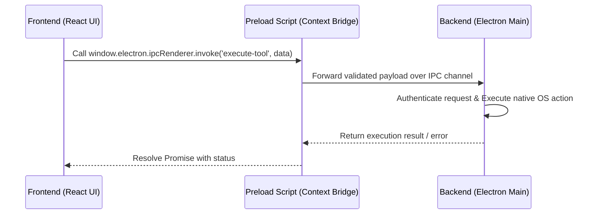

# System Design and Architecture

IRIS utilizes a strict split-process architecture to ensure security, high performance, and UI responsiveness. The system is divided into an untrusted frontend and a highly privileged, protected backend.

## Architectural Breakdown

### 1. Frontend (React 19 & Tailwind CSS)
The Renderer Process handles the visual layer and audio capture. Built with React 19, Tailwind CSS v4, and Framer Motion, it provides a premium, responsive user interface. It contains **no Node.js modules** and has zero direct access to the file system or native OS APIs.

### 2. Backend (Electron Main Process)
The Main Process runs the core engine. It manages the LangGraph orchestration, local execution tools, and native OS integrations. 

### 3. V8 Bytecode Protection
To protect proprietary execution logic, the backend code is compiled into **V8 Bytecode** (`.jsc` files) prior to packaging. This ensures that the core orchestration, security vault logic, and tool execution routines remain closed-source and cannot be easily reverse-engineered, maintaining the integrity of the monetized components.

## The IPC Bridge

All communication between the React frontend and the Electron backend occurs over a strictly typed Inter-Process Communication (IPC) bridge. 

By enforcing this strict boundary, IRIS guarantees that malicious UI state cannot directly execute arbitrary Node.js code, safeguarding the host operating system.
